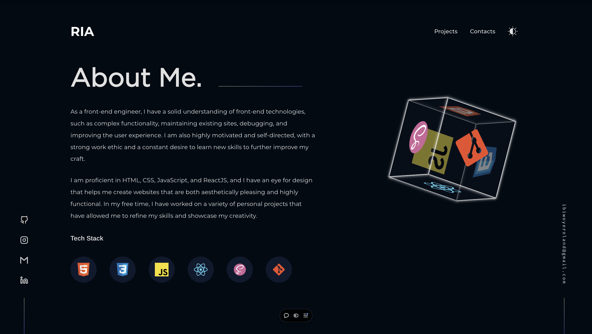

  <h2 align="center">Roland Ibiwoye's Portfolio</h2>

A portfolio is an extraordinary medium for demonstrating to business owners, hiring managers, tech recruiters, or anyone the skills and projects you've built.

<a href="https://rolandayo.vercel.app/"><strong>➥ Live Demo</strong></a>

 

### Demo Screeshots

This portfolio highlights the projects and programming languages used in production. It's often difficult to express what you can offer to someone without having an exact representation of what you can provide as value. With a portfolio, we can do exactly that, with direct links to the application and remote repository. Each project has been predominantly constructed with front-end libraries and programming languages. The projects provided can also showcase real-life examples of how I work and the approach I take to solve legitimate systemic business inefficiencies.

If you have an offer, opportunity, or introduction that might make my life more interesting, email me at ibiwoyeroland@gmail.com.

For the reasons stated above, I'll only respond to proposals that are matched for my schedule and interests.

## 📖 Documentation

**General Idea:** Build a web app that displays projects I've built.

**Audience:** Hiring Managers, Business Owners, and Tech Recruiters

**Goal of Project:** Getting a job from a company, small business, or a contract from a tech recruiter.

**Future Updates**

- Minor project database JS file
- Interactive video
- Blog post

### License

This project is **free to use** and does not contains any license.
